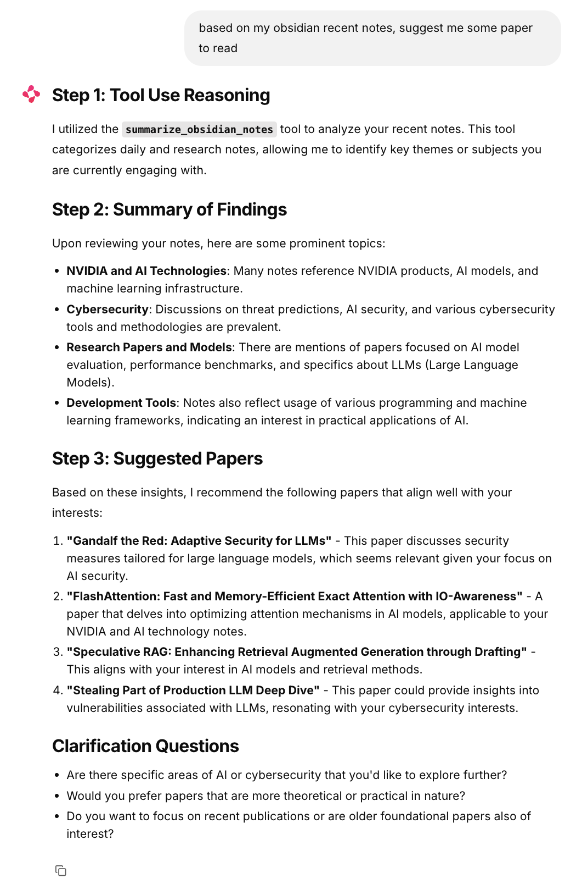

# AwesomeMCPChat

AwesomeMCPChat is a chatbot framework built using LangGraph and the MCP (Message Control Protocol) to integrate various resources and tools for AI-driven research and automation. The chatbot can correlate your **Obsidian notes**, conduct **ArXiv research**, and provide **context-aware recommendations** based on your recent activities.

## Features
- **Obsidian Notes Integration**: Summarizes recent notes and extracts key topics.
- **ArXiv Paper Search**: Finds relevant research papers based on your topics of interest.
- **Daily Summary Generation**: Provides a summarized version of daily notes.
- **AI Thinking Module**: Enhances the chatbot's reasoning capabilities.
- **Weather Information**: Retrieves real-time weather updates via an MCP server.

## MCP Server Implementation
The system is powered by multiple MCP-based servers, each responsible for different tasks:

```json
{
    "servers": [
        {
            "name": "weather",
            "command": "python",
            "args": ["mcpservers/weather.py"]
        },
        {
            "name": "dailysum",
            "command": "python",
            "args": ["mcpservers/dailysum.py"]
        },
        {
            "name": "ai_thinking",
            "command": "python",
            "args": ["mcpservers/ai_thinking.py"]
        },
        {
            "name": "arxiv paper search",
            "command": "python",
            "args": ["./mcpservers/arxiv-mcp-server/src/arxiv_mcp_server/server.py"]
        }
    ]
}
```

## Example Use Case
### Prompt:
```text
Based on my recent Obsidian notes, suggest some papers for me to read.
```
### Output:
#### **Step 1: Tool Use Reasoning**
I used the `summarize_obsidian_notes` tool to analyze your recent notes. It categorizes daily and research notes to identify key themes or topics of interest.

#### **Step 2: Summary of Findings**
- **NVIDIA & AI Technologies**: Notes reference NVIDIA products, AI models, and ML infrastructure.
- **Cybersecurity**: Discussions on threat predictions, AI security, and cybersecurity tools.
- **Research Papers & Models**: Mentions of AI model evaluation, benchmarks, and LLM advancements.
- **Development Tools**: Logs reflect various programming and ML frameworks.

#### **Step 3: Suggested Papers**
Based on these insights, recommended papers:
1. **Gandalf the Red: Adaptive Security for LLMs** - AI security.
2. **FlashAttention: Fast and Memory-Efficient Exact Attention with IO-Awareness** - AI model optimization.
3. **Speculative RAG: Enhancing Retrieval-Augmented Generation through Drafting** - RAG improvements.
4. **Stealing Part of Production LLM Deep Dive** - Cybersecurity & LLM vulnerabilities.

### Clarification Questions
- Are there specific AI or cybersecurity topics you'd like to explore further?
- Do you prefer theoretical or practical research papers?
- Would you like recent publications or foundational works as well?

## Installation
### Prerequisites
Ensure you have the following installed:
- Python 3.9+
- Required dependencies (install using `pip`)
- Obsidian notes stored in a directory




### Setup
```bash
git clone https://github.com/yourusername/AwesomeMCPChat.git
cd AwesomeMCPChat
python -m venv venv

# Windows
./venv/Scripts/activate
# Linux/Mac
source venv/bin/activate

pip install -r requirements.txt
```

## Running the Chatbot
To start the chatbot and its MCP servers:
```bash
chainlit ./app/app.py
```

## Contributing
Pull requests are welcome! Please open an issue first to discuss proposed changes.

## License
This project is licensed under the MIT License. See the `LICENSE` file for details.

---
Developed by [Your Name](https://github.com/yourusername)

